 
## 查看主页获取源码

> **作者介绍**： **✌**全网粉丝10W+本平台特邀作者、博客专家、CSDN新星计划导师、java领域优质创作者,博客之星、掘金/华为云/阿里云/InfoQ等平台优质作者、专注于项目实战 **✌**

  

### 一、作品包含

源码+数据库+设计文档万字+PPT+全套环境和工具资源+部署教程

### 二、项目技术

前端技术：Html、Css、Js、Vue、Element-ui

数据库：MySQL

后端技术：Java、Spring Boot、MyBatis

  

### 三、运行环境

开发工具：IDEA/eclipse

数据库：MySQL5.7

数据库管理工具：Navicat10以上版本

环境配置软件： JDK1.8+Maven3.6.3

前端Nodejs：14

### 四、项目介绍
项目编号：springbootA111

员工管理系统是在企业规模扩大、人力资源管理需求日益复杂的背景下应运而生的，它通过集成员工信息，旨在帮助企业提高人力资源管理的效率，确保员工数据的准确性，促进内部沟通，同时为管理层提供决策支持，推动企业实现人力资源的数字化和智能化。

管理员的功能：系统首页、个人中心、员工管理、部门管理、请假申请管理、出勤记录管理、奖惩信息管理、工资信息管理。
用户的功能：系统首页、个人中心、请假申请管理、出勤记录管理、奖惩信息管理、工资信息管理。

### 五、运行截图

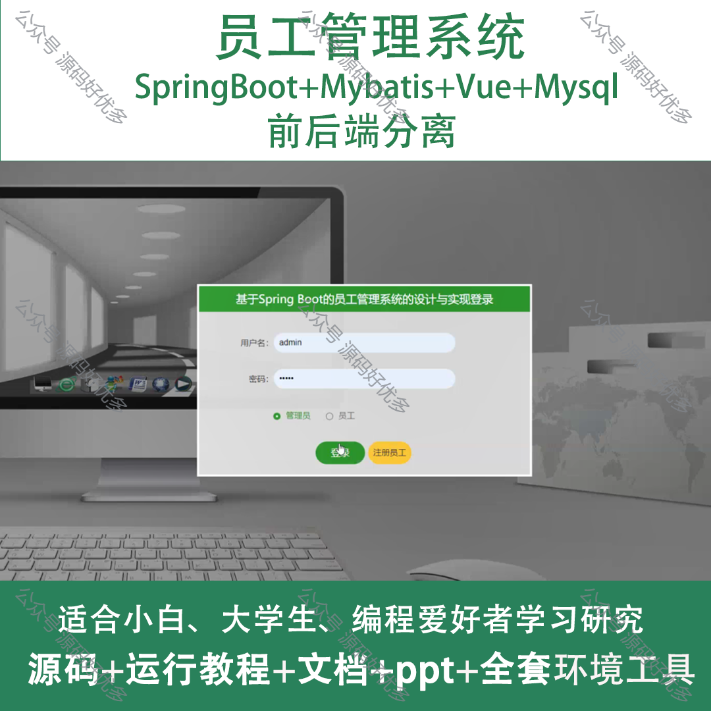
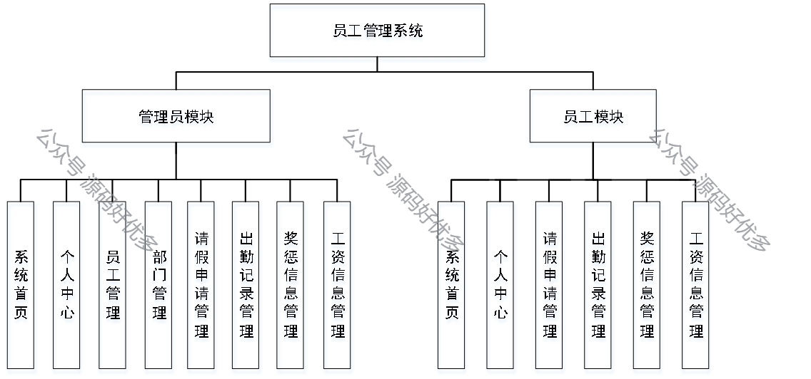
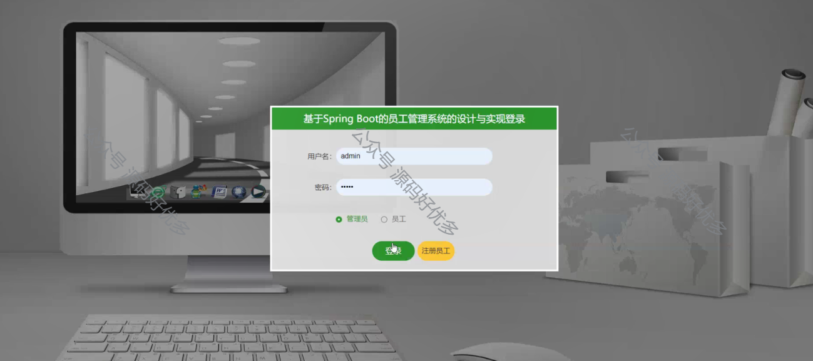
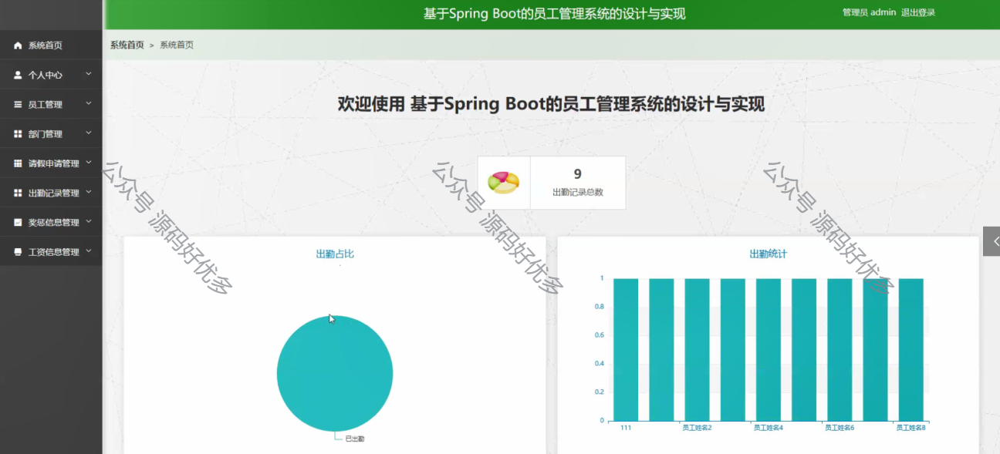
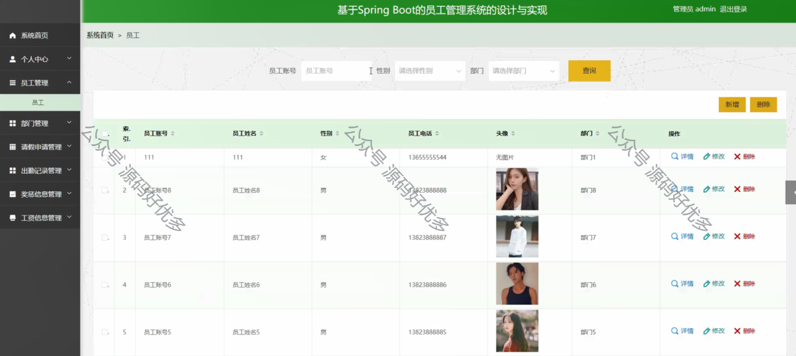
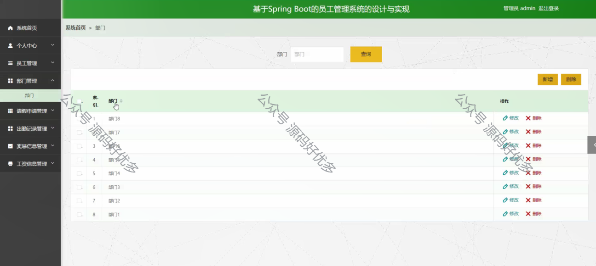
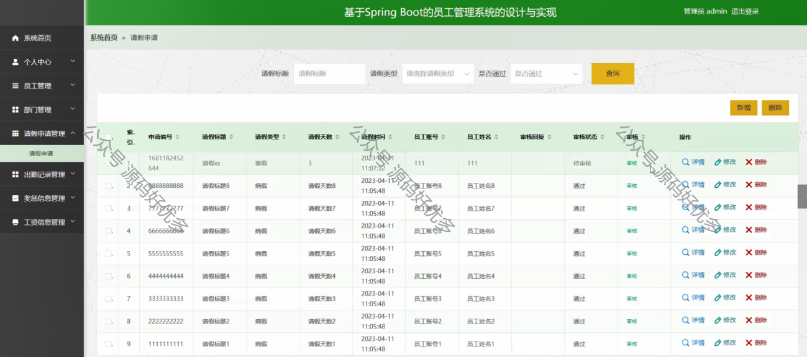
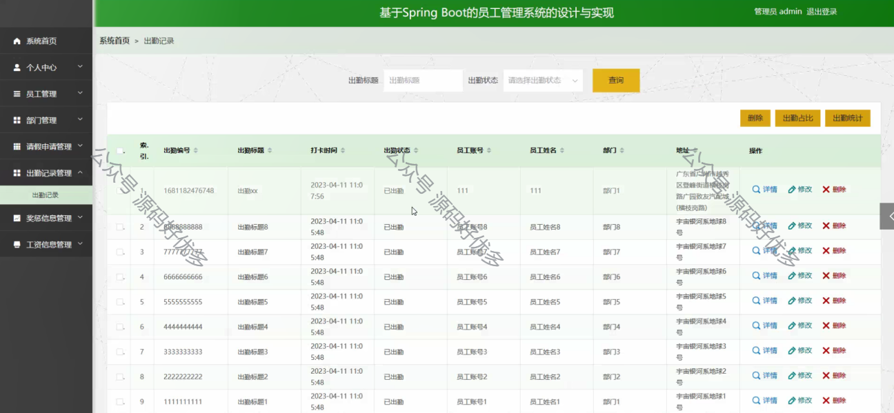
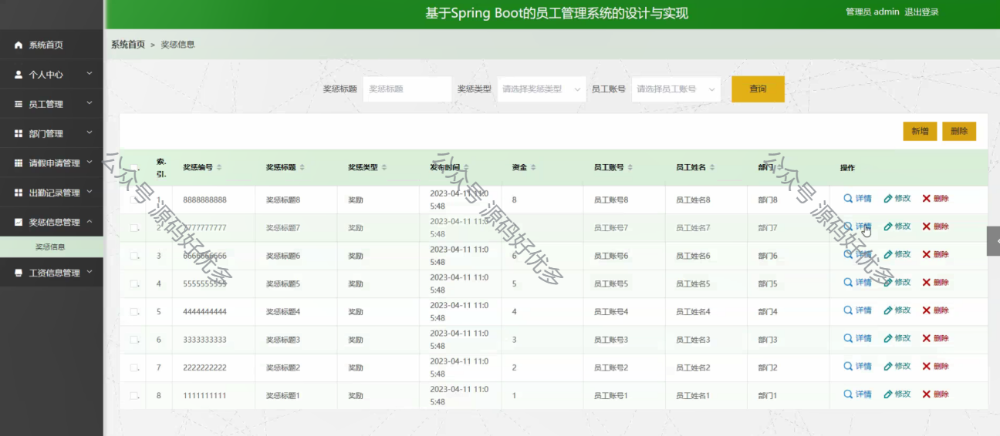
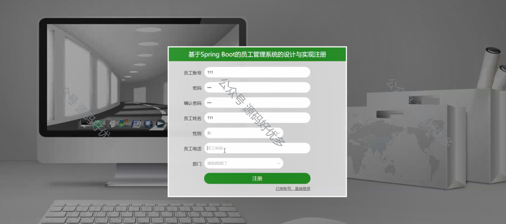
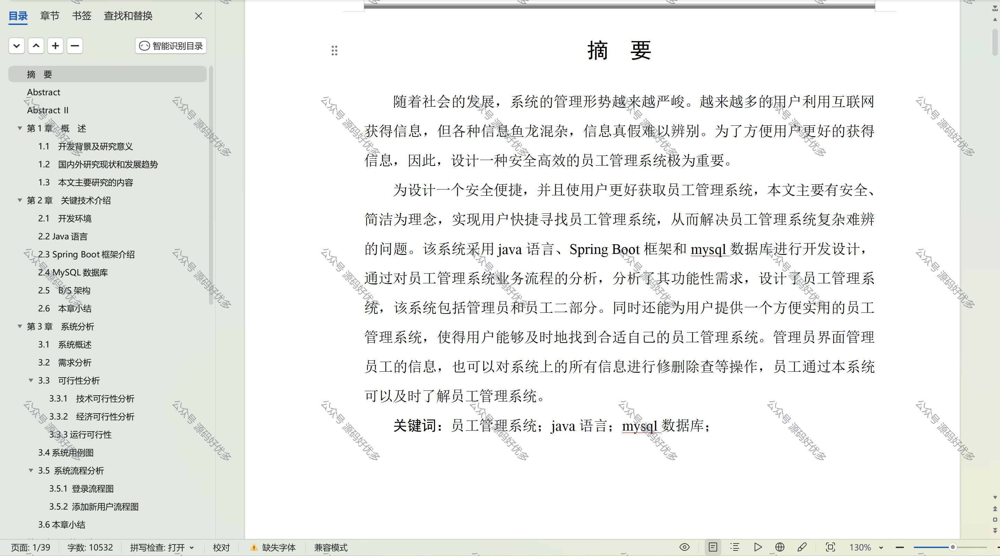

  
